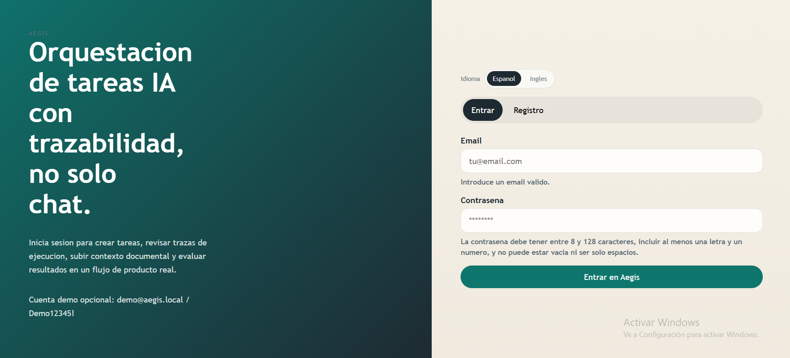
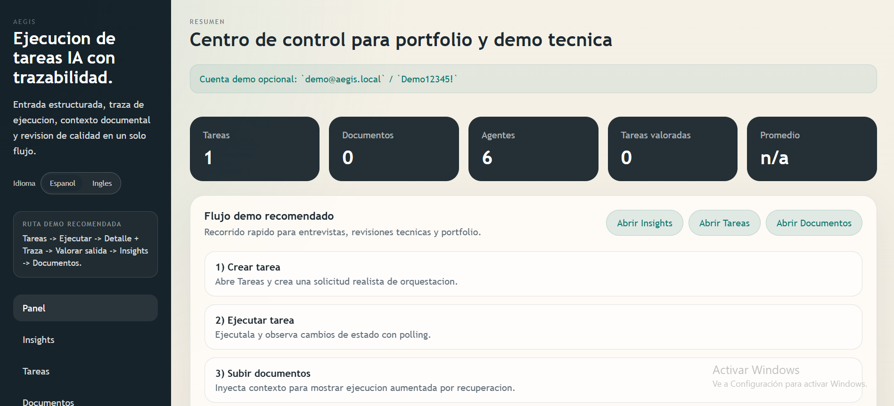
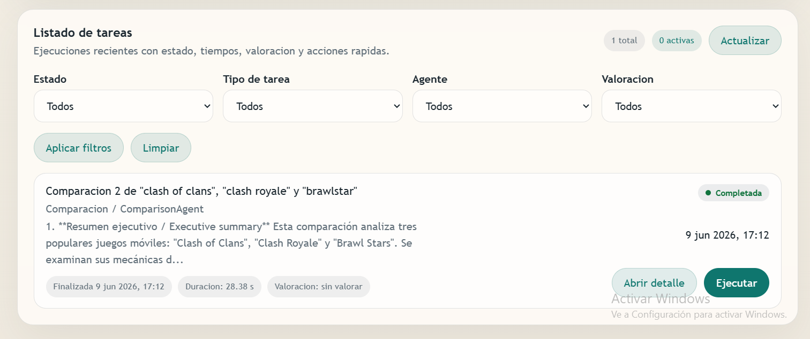
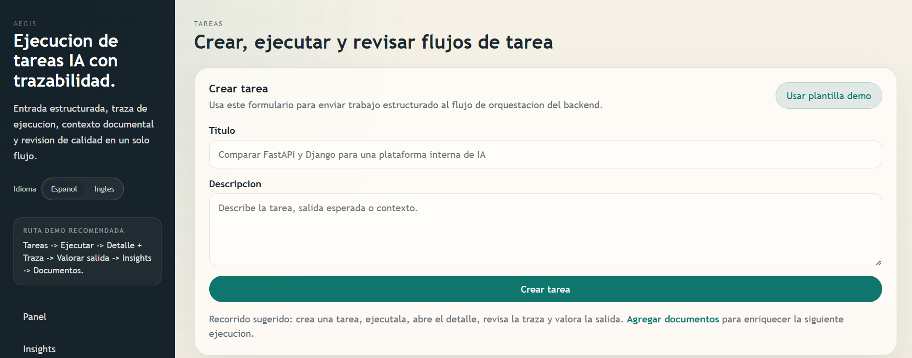
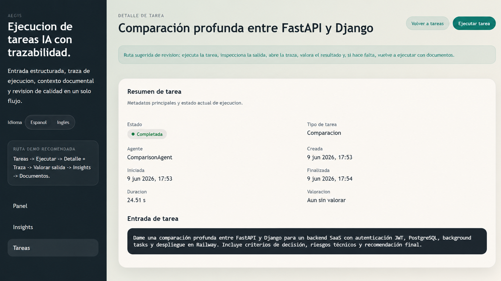
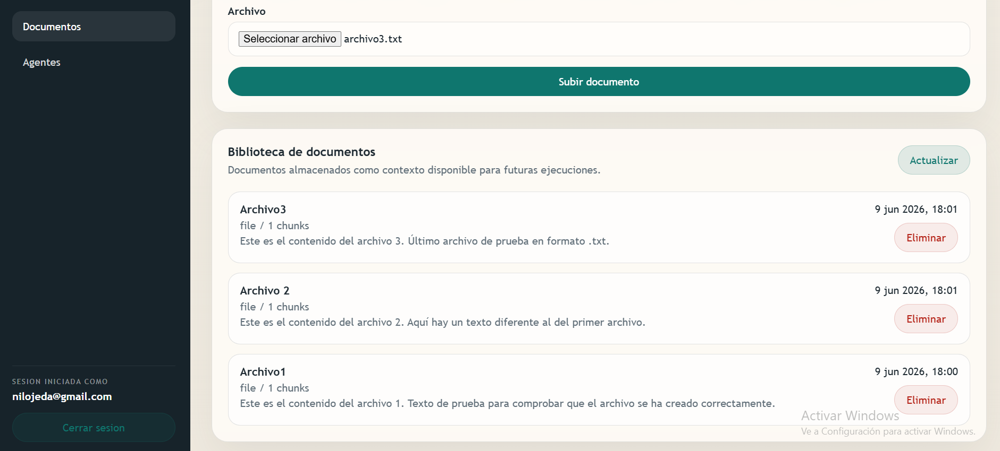
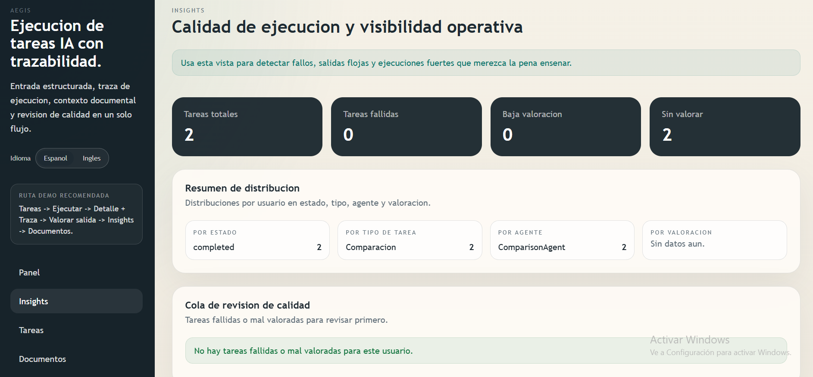

# Aegis

Orquestación backend-first de tareas con IA, trazabilidad, contexto documental y resultados revisables.

> Aegis es un MVP técnico orientado a portfolio y entrevistas técnicas.  
> Su valor está en demostrar un flujo completo - `tarea -> clasificacion -> seleccion de agente -> ejecucion -> traza -> feedback -> insights` - y no solo una respuesta aislada de chat.

## Qué Es Aegis

Aegis es un proyecto full-stack que muestra cómo puede verse un flujo asistido por IA cuando se diseña como software de producto y no como una simple caja de chat.

La idea principal es sencilla:

- una persona crea una tarea estructurada
- el backend clasifica la solicitud
- se selecciona un agente o ruta de ejecución
- la ejecución se persiste con estado y trazabilidad
- el resultado puede revisarse y valorarse después
- insights agrega señales de calidad y operación

No se presenta como una plataforma completamente lista para producción. Se presenta como un proyecto de portfolio serio, honesto y con alcance real de ingeniería.

## Problema Que Resuelve

Muchas demos de IA se quedan en `prompt -> respuesta`.

Aegis enseña un flujo más cercano a un producto real:

- entrada estructurada de trabajo en lugar de chat libre únicamente
- clasificación y enrutamiento de tareas
- ciclo de ejecución persistido
- trazabilidad visible por pasos
- revisión de resultados y señal ligera de calidad
- subida de documentos para aportar contexto por recuperación
- insights para revisión operativa

Eso permite hablar con más profundidad sobre arquitectura, estado, control de calidad y observabilidad en entrevistas.

## Funcionalidades Principales

- backend FastAPI con estructura por capas
- frontend React + Vite con flujo autenticado
- sesión web vía cookie `HttpOnly`
- creación, listado, ejecución y detalle de tareas
- traza de ejecucion persistida con metadatos de tarea
- evaluación ligera del resultado con rating + comentario
- subida de documentos y contexto orientado a retrieval
- vista de insights para ejecuciones fallidas, débiles o fuertes
- ejecución local con Docker y cobertura de tests backend/frontend

## Flujo De Demo

Recorrido recomendado para una demo de 3 a 5 minutos:

1. Iniciar sesión con el usuario demo.
2. Crear una tarea realista desde la vista de Tareas.
3. Ejecutarla y enseñar los cambios de estado.
4. Abrir el detalle y revisar resultado + traza de ejecucion.
5. Enviar feedback sobre la calidad de la salida.
6. Subir un documento y explicar el contexto asistido por recuperación.
7. Abrir Insights y mostrar ejecuciones débiles y fuertes.

Guion detallado:

- `docs/DEMO_SCRIPT.md`

## Stack Técnico

| Capa | Tecnología |
| --- | --- |
| Backend | Python, FastAPI, Pydantic, SQLAlchemy 2.x |
| Base de datos | PostgreSQL |
| Migraciones | Alembic |
| Auth | Flujo de sesión basado en JWT para web mediante cookie `HttpOnly` |
| Frontend | React, Vite |
| Infra | Docker Compose, Nginx |
| Testing | `unittest`, Vitest, React Testing Library |
| Capa IA | clasificación de tareas, routing de agentes y abstracción opcional de proveedor LLM |

## Arquitectura

### Backend

- `backend/app/api/` expone endpoints REST de auth, tasks, documents, insights, agents y health.
- `backend/app/services/` concentra orquestación, clasificación, selección y lógica de contexto documental.
- `backend/app/models/` y `backend/app/schemas/` definen persistencia y contratos API.
- `backend/app/core/` centraliza configuración, seguridad y base de datos.

### Frontend

- `frontend/src/pages/` contiene las vistas principales: auth, dashboard, tasks, task detail, documents e insights.
- `frontend/src/components/` agrupa piezas compartidas como estados async, render de traza y layout.
- `frontend/src/context/` y `frontend/src/hooks/` gestionan auth, i18n y polling.

### Runtime

- `docker-compose.yml` levanta `backend`, `frontend` y `db`.
- `alembic/` es la única fuente de verdad de migraciones.
- La validación local usa tests backend, tests frontend, build y validación de Compose.

## Flujo Principal

```txt
tarea`r`n  -> clasificacion`r`n  -> seleccion de agente`r`n  -> ejecucion`r`n  -> persistencia de traza`r`n  -> feedback`r`n  -> insights
```

Ésta es la parte más importante del proyecto: Aegis está pensado para enseñar un flujo auditable de tareas, no solo generación de texto.

## Capturas

La estructura para capturas ya está preparada, pero las imágenes reales todavía deben añadirse antes de publicar el portfolio.

Carpeta esperada:

- `docs/screenshots/`

Placeholders preparados:









Guía de capturas:

- `docs/SCREENSHOT_GUIDE.md`

## Cómo Ejecutarlo En Local

### Docker

```bash
cp .env.example .env
docker compose --env-file .env up --build -d
docker compose --env-file .env run --rm backend alembic upgrade head
```

URLs principales:

- frontend: `http://localhost:5173`
- backend: `http://localhost:8000`
- health: `http://localhost:8000/api/v1/health`

### Backend + Frontend en local

```bash
docker compose --env-file .env up -d db

cd backend
python -m venv .venv
.venv\Scripts\activate
pip install -r requirements.txt
$env:AEGIS_ENV_FILE=".env"
python -m alembic -c ..\alembic.ini upgrade head
uvicorn app.main:app --reload --host 0.0.0.0 --port 8000

cd ../frontend
npm install
npm run dev
```

## Cómo Ejecutar Tests

### Backend

```bash
cd backend
python -m unittest discover -s tests -t . -p "test_*.py" -v
```

### Frontend

```bash
cd frontend
npm ci
npm run test
npm run build
npm run check:smoke
```

### Validación de Compose

```bash
docker compose --env-file .env.example config
```

## Seed De Demo

Para cargar el usuario demo y datos de ejemplo:

```bash
docker compose --env-file .env run --rm backend alembic upgrade head
docker compose --env-file .env run --rm backend python -m scripts.seed_demo_data
```

## Variables De Entorno

Los secretos reales deben vivir solo en tu `.env` local. No lo subas ni lo compartas.

Variables importantes:

```env
APP_ENV=development
JWT_SECRET_KEY=replace-with-a-long-random-jwt-secret-min-32-chars
ACCESS_TOKEN_EXPIRE_MINUTES=30

AUTH_COOKIE_NAME=aegis_access_token
AUTH_COOKIE_SECURE=false
AUTH_COOKIE_SAMESITE=lax

DATABASE_URL=postgresql+psycopg://...

DOCUMENT_ALLOWED_EXTENSIONS=.txt,.md,.csv,.json
DOCUMENT_ALLOWED_MIME_TYPES=text/plain,text/markdown,text/csv,application/json

LLM_PROVIDER=template
LLM_ENABLE_REAL_CALLS=false
OPENROUTER_API_KEY=
OPENROUTER_MODEL=
```

Plantilla de referencia:

- `.env.example`

## Seguridad Y Hardening Aplicado

- ningún `.env` real debe subirse ni compartirse
- `.env.example` se mantiene como plantilla segura
- la sesión web deja `localStorage` y usa cookie `HttpOnly`
- Alembic sustituye la mutación de esquema en runtime
- se añadió paginación en endpoints principales de listado
- se endurecieron validaciones de auth, tasks y documents
- se añadieron headers HTTP básicos de seguridad
- se reforzó la validación de subida documental y los defaults seguros

## Limitaciones Conocidas

- Aegis **no** se presenta como completamente production-ready.
- el rate limiting sigue siendo **in-memory**
- la ejecución en background todavía **no** usa una cola durable
- el runtime real en Docker debe validarse en un entorno con daemon disponible
- RAG sigue en nivel MVP y no incorpora aún una evaluación semántica profunda
- no existe todavía una suite E2E de navegador completa tipo Playwright o Cypress
- el manejo actual de documentos está pensado para demo y portfolio, no para almacenamiento enterprise a gran escala

Estas limitaciones están documentadas a propósito porque demuestran criterio de ingeniería, no debilidad.

## Roadmap

- añadir capturas reales y una demo pública mejor rematada
- ampliar cobertura E2E del flujo principal
- reforzar observabilidad y validación preproducción
- evolucionar la ejecución en background hacia una cola durable si el proyecto crece

## Qué Demuestra Este Proyecto

Para recruiters, hiring managers y revisores técnicos, Aegis demuestra:

- pensamiento de producto full-stack en backend, frontend y documentación
- diseño de API y manejo de flujos con estado
- persistencia, trazabilidad y patrones de revisión de calidad
- hardening de seguridad pragmático para una app de portfolio
- disciplina documental y preparación de demo
- capacidad de acotar el proyecto con honestidad, sin sobre-venderlo

## Cómo Explicarlo En Una Entrevista

Versión corta:

> Aegis es un proyecto backend-first de orquestación de tareas con IA.  
> En lugar de quedarse en prompt/respuesta, muestra un flujo completo con entrada de tareas, enrutamiento, traza de ejecucion, feedback e insights.

Puntos de conversación útiles:

- por qué una tarea estructurada no es lo mismo que un chatbot genérico
- por qué la trazabilidad mejora confianza y depuración
- por qué feedback e insights hacen el sistema más revisable
- qué partes ya están endurecidas y qué cambiaría antes de producción

Notas de entrevista detalladas:

- `docs/INTERVIEW_NOTES.md`

## Documentación Adicional

- guía de uso: `GUIA_USUARIO_NUEVO.md`
- guion de demo: `docs/DEMO_SCRIPT.md`
- notas de entrevista: `docs/INTERVIEW_NOTES.md`
- guía de capturas: `docs/SCREENSHOT_GUIDE.md`
- estrategia de testing: `docs/TESTING_STRATEGY.md`
- notas de despliegue en Railway: `docs/DEPLOYMENT_RAILWAY.md`


